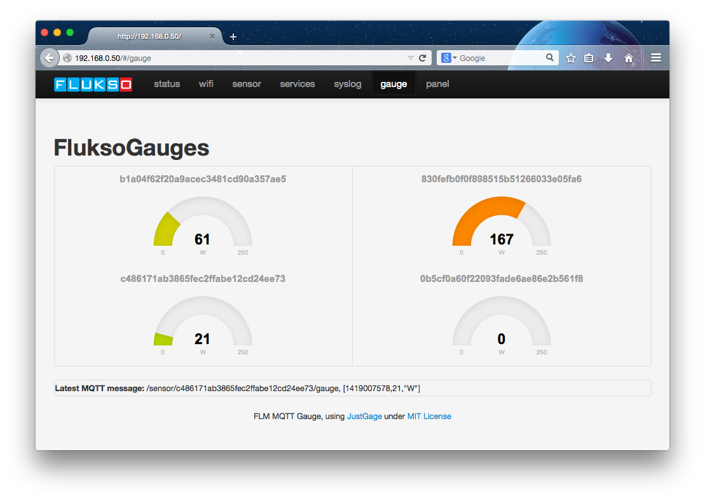

#FLM local visualizations
This is a native implementation of the [Justgage](http:/justgage.com) gauges and a plain panel to be used in the [Fluksometer's](http://flukso.net) AngularJS based user interface. It sits on top of the [Paho JavaScript client](https://eclipse.org/paho/clients/js/). 
To utilize this implementation, copy the content of the [www/](www/) folder to your Fluksometer with firmware version >2.4. 
Use the linux/OSX command **scp** for this purpose; for windows use [WinSCP](http://winscp.net).

`scp -r * root@<FLM ip address>:/www/`

You are prompted for the root's password, then all necessary files are transferred (recursively through option -r)

By that you gain direct access to a local gauge and panel visualization directly from the Fluksometer's landing page navigation when calling

`<flm ip address>`

in your browser.

 

With a next version of the Fluksometer firmware there will be a dedicated topic on which the FLM's configuration is published; this adaptation is also available for an "old" fluksometer using the code provided in [/usr/sbin/fluksod.lua](/usr/sbin/fluksod.lua) - this enhances the flukso daemon by the corresponding functionality; use at own risk (after scp copy a reboot of the FLM is required).

This code under [MIT license](LICENSE); all used libraries/includes with the respective license noted.