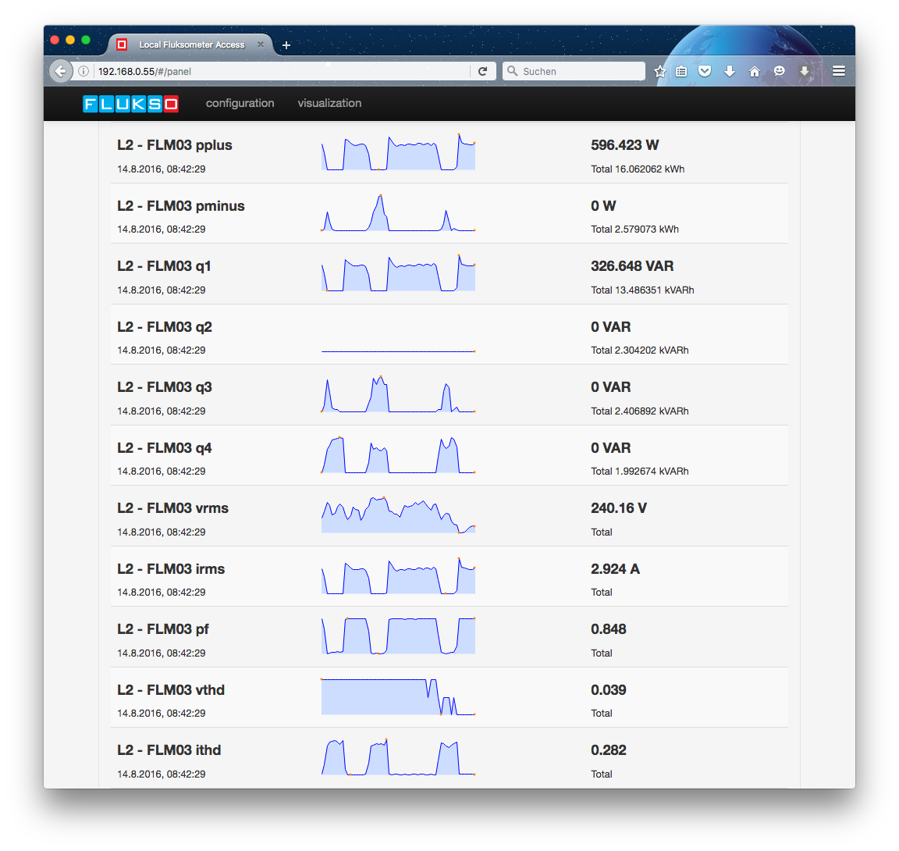
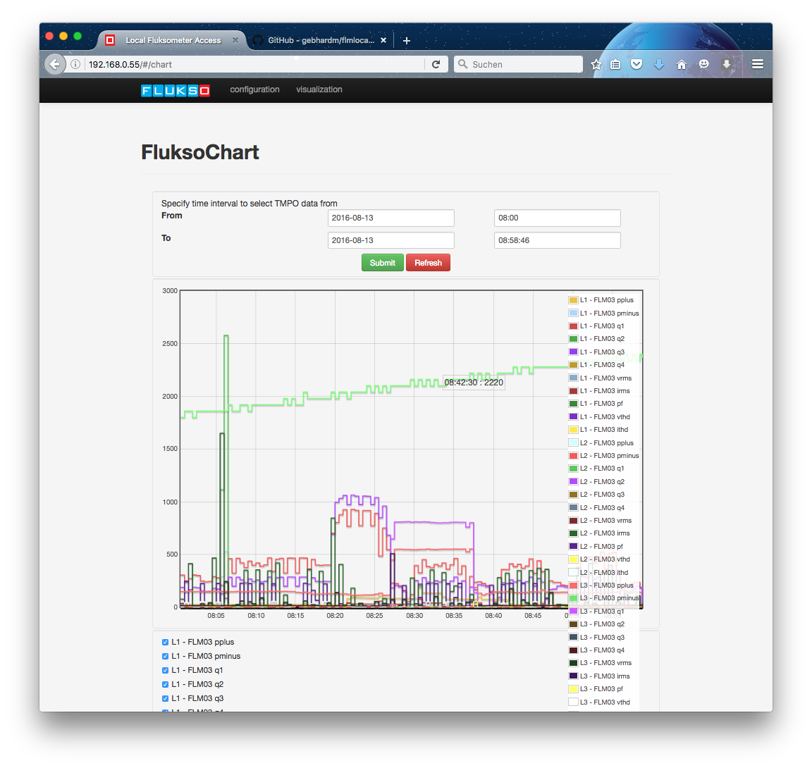
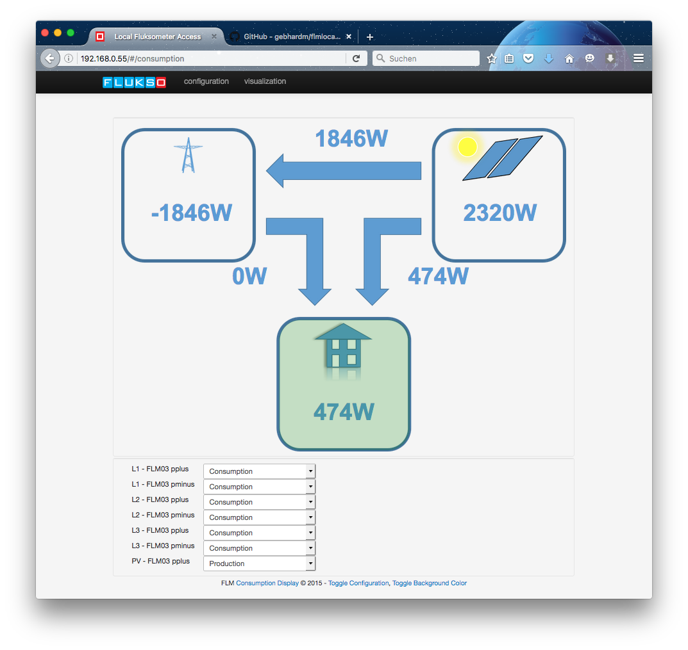

# FLM local visualizations
This repository contains a selection of visualizations that run directly on the [Fluksometer](http://www.flukso.net/about) as an addendum to its inherent firmware.

It contains a native implementation of [Justgage](http:/justgage.com) generic gauges (despite the FLM03 onboard variant), [Flot](http://www.flotcharts.org/) charts and graph, a plain panel and a "simple consumption view" to be used with the [Fluksometer's](http://flukso.net) AngularJS based user interface.

The implementation sits on top of the [Paho JavaScript client](https://eclipse.org/paho/clients/js/) to receive and compute MQTT (sensor) messages.

## How to use
To utilize this implementation, **clone or download** this [repository](https://github.com/gebhardm/flmlocal). Check out the fitting branch of your Fluksometer, so either [flm02](https://github.com/gebhardm/flmlocal/tree/flm02) or [flm03](https://github.com/gebhardm/flmlocal/tree/flm03) or choose a "packed" variant per [release/tag](https://github.com/gebhardm/flmlocal/releases).
I will keep the [master branch](https://github.com/gebhardm/flmlocal/tree/master) on the stable version for the newest Fluksometer. In case of uncertainty refer to the [commit history](https://github.com/gebhardm/flmlocal/network)).

Then copy the content of the respective [www/](www/) folder to your Fluksometer version 02 or 03E with firmware version v250 or  v380 respectively (for the FLM03E versions 378 and 380 there is no difference in the UI).

The current implementation reflects the state as of the corresponding FLM firmware version (please note that the original files `www/index.html` and `www/scripts/app.js` are overwritten; a factory reset should recover these). 

Use the Linux/MacOS command **scp** for this purpose; for windows use [WinSCP](http://winscp.net). When changed to the [www/](www/) directory, perform a

    scp -r * root@<FLM ip address>:/www/

Note: With legacy encryption installed, it may be necessary to explicitly allow the used encryption mode for file transfer:  `scp -oKexAlgorithms=+diffie-hellman-group1-sha1 -r * root@<FLM ip address>:/www/`

You are prompted for the root's password (default is `root`, better change it), then all necessary files are transferred (recursively through option -r) to your Fluksometer.

By that you gain direct access to the different visualization alternatives directly from the Fluksometer's landing page navigation when calling

    http://<flm ip address>

in your browser (you may find the FLM also through Bonjour/service discovery). Be aware that due to overcrowding by the larger number of navigation options I condensed the selection of the different configuration and visualization pages into corresponding dropdown menus.

For a **step-by-step description**, please refer to the [howto/](howto/) folder and its [ReadMe](https://github.com/gebhardm/flmlocal/blob/master/howto/ReadMe.md) file (the process as such is equivalent for FLM02 and FLM03, respectively, but be aware of the different implementations for FLM02 and FLM03; they are **not** equal and **not** compatible).

All code is JavaScript with corresponding HTML utilizing the FLM's AngularJS user interface. With this implementation also all necessary libraries are copied; so there is no need to install anything else.

## Recognizing device configuration
The Fluksometer provides dedicated MQTT topics to reflect its configuration. On topic `/device/<device id>/config/sensor` all parameters are available that indicate specific sensor settings. `/device/<device id>/config/flx` publishes the actual port configuration of the FLM itself, together with the port given name. This in combination is used to show the actual sensor names instead of just their IDs.

## Querying TMPO data
Introduced with the FLM02 there is an FLM local storage of counter values. This feature is called **TMPO**; refer to the corresponding [announcement](https://www.flukso.net/content/r246-release-notes) for more information.

With [/usr/sbin/queryd.lua](/usr/sbin/queryd.lua) and the corresponding chart visualization on the FLM exists a query daemon capable to retrieve locally stored TMPO time series files and visualize them; this may be used for data analysis without having to store data on an external database.

### TMPO query daemon
To install this feature, copy the [queryd.lua](/usr/sbin/queryd.lua) file to the `/usr/sbin` folder of your FLM using **scp**.

    scp queryd.lua root@<FLM IP address>:/usr/sbin/queryd.lua

This query provider you may run with `lua /usr/sbin/queryd.lua &`.

As an alternative you may install this also as a "real" daemon. For this you have to add a  symbolic link

    ln -s /usr/sbin/luad /usr/sbin/queryd

and start the query daemon by

    /usr/sbin/queryd -u flukso

For automated start on reboot you have to change the `/etc/init.d/flukso` initialization file accordingly. Make a backup first! (`cp /etc/init.d/flukso /etc/init.d/flukso.bak`)
Take a look at a reference [flukso.init](/etc/init.d/flukso) file for what to change (basically it is just the start and stop of the query daemon).

### Query daemon functionality
The query daemon works as follows:

Sending an MQTT message to the FLM's MQTT broker with following content

    topic: /query/<sid>/tmpo
    payload: [<fromtimestamp>, <totimestamp>]

will be computed by the query daemon. Corresponding to the sent query time interval (the same timestamp format as provided by the `/sensor`-topics is used, thus a POSIX timestamp on second base) one or more fitting TMPO files are retrieved (which are compressed using **gzip**) and sent back, that is published, on

    topic: /sensor/<sid>/query/<fromtimestamp>/<totimestamp>
    payload: <gzipped tmpo file>

The content of the queried data then is decompressed and computed with a JS script in the browser. It is displayed as a FluksoChart using Flot charts like in the FluksoGraph. 
For smoothing the graphs (visualized is the first derivative of the counter increase values with respect to time - actually a "simple difference calculation" of the TMPO-stored counter values) a continuous average on minute based values is displayed. This is done as on raw data there are extreme "bumps" due to the discreteness and approximation of the original counter value set also on second base; if displayed directly, you will experience a kind of "pulse width modulation" which is rather inconvenient to the eye and stresses the Flot chart to an extreme. You may play with the value of *n* in [chart.js](https://github.com/gebhardm/flmlocal/blob/master/www/scripts/controllers/chart.js#L176), *function chart_sensor(sensor)*.

In the chart you may select by mouse details from a smaller time interval (does sadly not seem to work on a tablet computer); also you may switch on and off the different graphs in the chart using the checkboxes underneath the diagram panel.

Please note: The FLM03 stores quite a lot of date; thus, the chart may be a bit crowded...

## Show Simple Consumption
As a further visualization variant, following a [discussion in the FluksoForum](https://www.flukso.net/content/simple-graphically-styled-display-summarising-everything-including-net-consumption), there is a simple consumption view, showing what is produced (e.g. by a PV installation), what is totally consumed and what is as difference taken from respective supplied to the power grid. The specialty of this visualization is, that sensors can be labelled as *producing* or *consuming* input. The display of the sensor configuration section can be toggled for convenience of the display.

## Credits
This code under [MIT license](LICENSE); all used libraries/includes with the respective license noted.

The gauge uses [JustGage](http://justgage.com/), the graphs are built using [Flot](http://www.flotcharts.org/) and the panel utilizes [jQuery Sparkline](http://omnipotent.net/jquery.sparkline/); the consumption view uses my humble own graphical representation. All utilizes [jQuery](https://jquery.com/). 
Corresponding licenses are the [MIT license](http://opensource.org/licenses/mit-license.php) and the [New BSD license](http://opensource.org/licenses/BSD-3-Clause).
