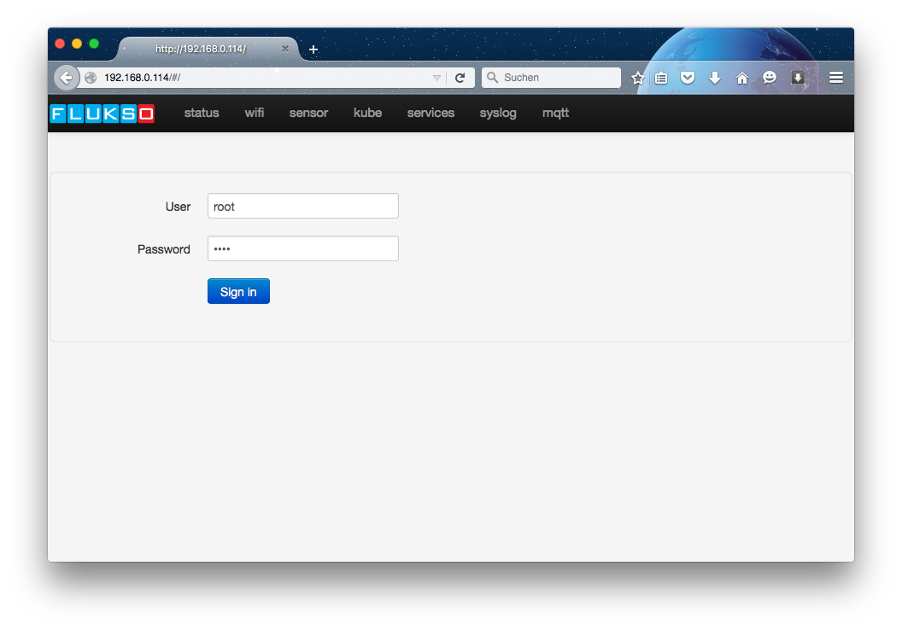
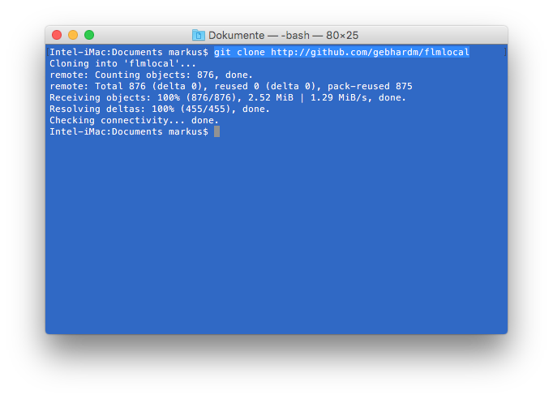
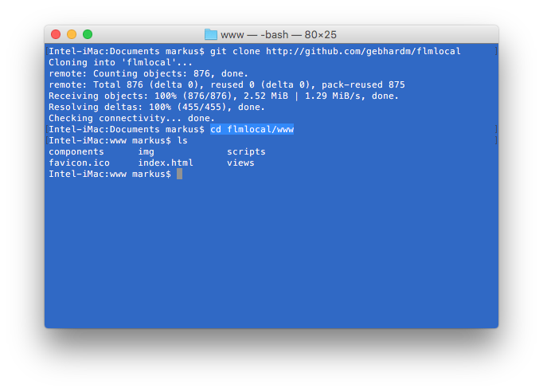
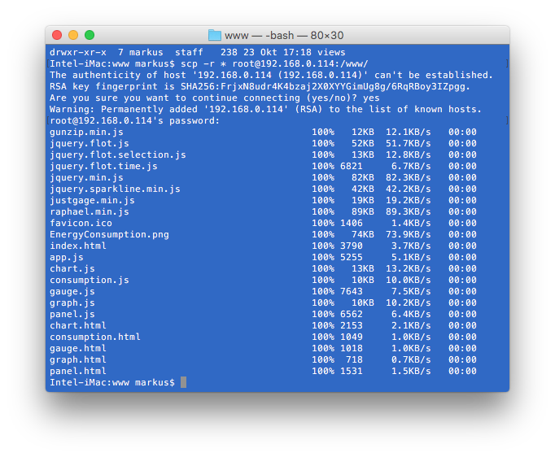
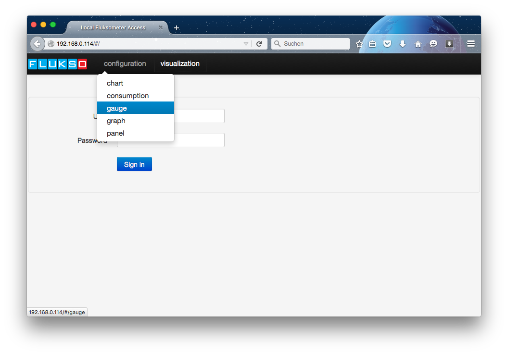

#Installing flmlocal visualizations
Installing the [fluksometer](http://flukso.net) alternative visualizations is fairly easy. In the following I will provide a step-by-step description to change the FLM's default landing page (the pages you get when opening the FLM's local IP address in a browser window) to provide a bunch of alternative display variants as described in the [flmlocal's ReadMe](https://github.com/gebhardm/flmlocal/blob/master/README.md) file.

##The beginning
You have your fluksometer up and running and know its local IP address; in this example I will use `192.168.0.114`. When accessing this address in a browser, you will get following display.

 

##Getting the sources
I assume you have installed [git](https://en.wikipedia.org/wiki/Git_%28software%29), this splendid version control system, on your computer; if not, do so by either visiting [git-scm.com](http://git-scm.com) or using whatever package installer runs on your computer (e.g. with `sudo apt-get git` on any Debian Linux Distribution).

Open a terminal window and `clone` the corresponding repository, that is, get the required files onto your computer. Use the command line

	git clone http://github.com/gebhardm/flmlocal
	
The corresponding repository is now copied onto your computer into the directory flmlocal, added to the directory you are currently in.

As an alternative, download the corresponding zip-file from [http://github.com/gebhardm/flmlocal](https://github.com/gebhardm/flmlocal/archive/master.zip) and unpack it to a folder you know.

##Changing directory to the files to copy
As the repository contains also a ReadMe file and this installation description, you have to switch directories and enter the one from where to copy the "correct" files onto your fluksometer. This is done, as depicted above, by a `cd flmlocal/www`. The `www/` directory corresponds to the webserver directory already existing on the fluksometer. Into this we will copy some more content and overwrite two existing files (`index.html` and `www/scripts/app.js`) to add the visualization functionality.

An `ls` shows the files in this directory, just out of curiosity.

##Copying the new functionality onto the FLM
Now we will copy the content of the `/www` folder onto the fluksometer. As this is a remote file transfer, we have to use `scp` for this purpose (windows users here have to use [WinSCP](http://winscp.net/)).

	scp -r * root@192.168.0.114:/www/
	
This reads "securely copy recursively (-r) all files from this directory (*) with user `root` to the destination directory `/www/` on location `192.168.0.114`".

Note that in my case the secure access was performed for the first time, thus an RSA key is exchanged. You are prompted for a password; the default is `root`.

That was basically it; you may close now the terminal window and check your result.

##Calling the new functionality
When accessing the fluksometer local address again in a browser window (e.g. by refreshing the page from "beginning"), you will recognize the changes.

Two new menus now provide access to the added functionality.

##Selecting a visualization
Using the drop down menus you now may select the visualization to your convenience.

Note that the chart needs also the [TMPO query daemon installed](https://github.com/gebhardm/flmlocal#querying-tmpo-data); this I will leave to the experts ;-)

